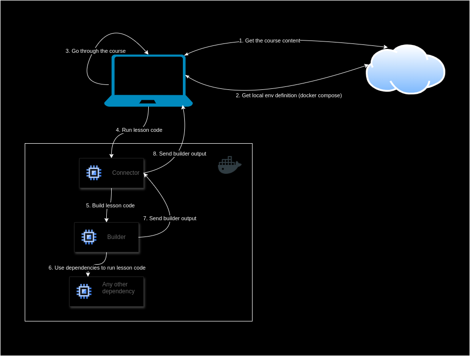

# Intro
This repo contains code illustrating the concept of local course code execution. Demo of this concept can be viewed at [https://mdztmp.pl/course/dynamodb](https://mdztmp.pl/course/dynamodb) where a short lesson about DynamoDB is presented.

# Idea

1. Student enters the course page and downloads from server course content (presentation etc). 
2. Student downloads definition of local environment in form of docker compose file and runs it locally.
3. Student goes through the course.
4. When student want's to run the code from the course the code is send to connector container inside docker. 
5. Connector passes the code to builder.
6. Builder executes the code with the use of any dependencies (e.g. in my demo local DynamoDB instance is a dependency).
7. Builder sends code execution result to connector.
8. Connector passes code execution result to course platform so student can inspect it.

# Proof of Concept components

`web` - server responsible for storing course content (basically a list of editor changes) and serving super simple course platform (`recorder` for course editor changes recording and `courser-viewer` for interacting with the course)

`connector` - service responsible for connection between course platform and `builder` responsible for course code execution. It is course agnostic so can be reused for any course based on this setup.

`builder` - responsible for executing the course code

## Course code execution and output sending

When `connector` gets the code to execute from course platform it stores it in the file. This file is shared with `builder` component via shared volume. `builder` is configured to rebuild the code on every file change.

In order to be able to send the execution output (in this PoC only console.log outputs) from `builder` when `connector` stores code in file it also adds an override for console.log which under the hood sends console.log parameters to `connector`.

# Proof of Concept implementation shortcomings

For the sake of this PoC sending of `builder` execution result is done by overriding `console.log` method which under the hood sends its arguments to `connector`. This is of course very limited approach. It is limited to languages which allow for such overriding and also neglects the build process output (e.g. errors) which might be very useful for students. If I had more time I would explore using custom docker logging driver for the purpose of sharing `builder` results to `connector`. 

